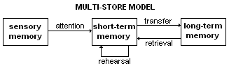

# Atkison-Shiffrin Memory Model
10 years after [[Broadbent's filter model of attention]] was introduced...

---
## References
[Atkinson–Shiffrin memory model - Wikipedia](https://en.wikipedia.org/wiki/Atkinson%E2%80%93Shiffrin_memory_model)

## Backlinks
* [[Which cognitive model should be used?]]
	* The similar thinking is applied for [[Atkison-Shiffrin Memory Model]].

<!-- #evergreen -->

<!-- {BearID:B8CB72D8-E84E-4EA2-BCD0-2A5A1FC37528-652-000002942ACFB0EA} -->
