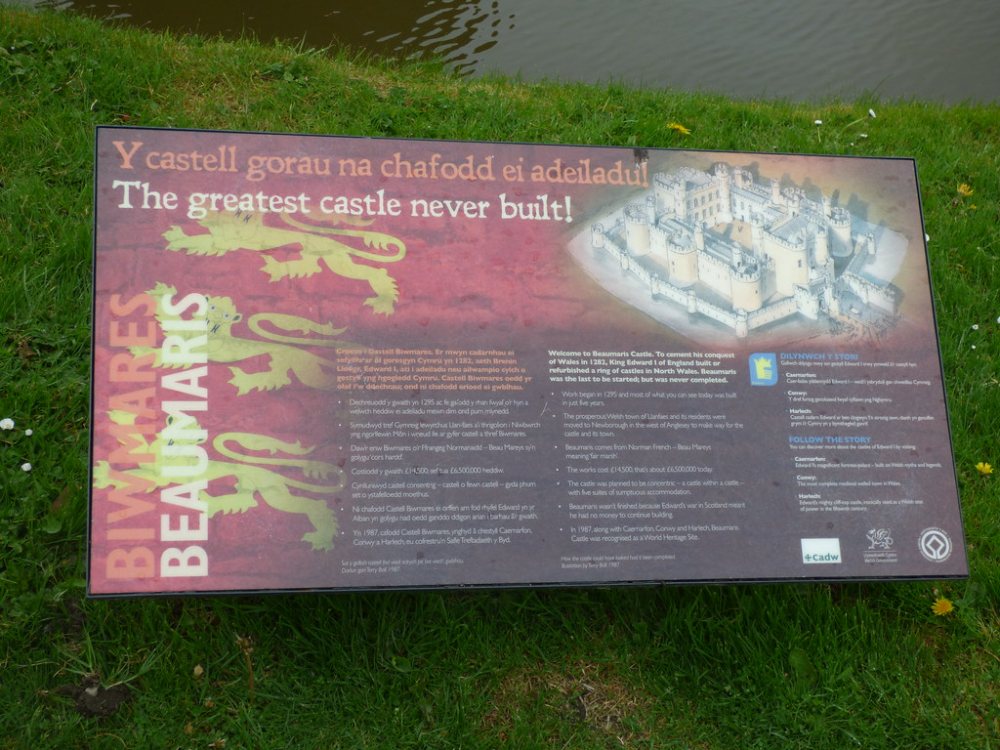

# Beaumaris architecture

([Beaumaris Castle - sign - The greatest castle never built!… | Flickr](https://www.flickr.com/photos/ell-r-brown/41753333144))

I visited the Beaumaris Castle during my holiday, one of the sign immediately reminded me of many software architectures that I saw throughout my career, it says:

> The greatest castle never built!

The castle were not completed due to the lack of funding, constant disruptions, the lack of focus, and finally remained incomplete as the money ran out. Sound familiar?

---
## References
[Beaumaris Castle - Wikipedia](https://en.wikipedia.org/wiki/Beaumaris_Castle)
> Edward’s invasion of Scotland soon diverted funding from the project, however, and work stopped, only recommencing after an invasion scare in 1306. When work finally ceased around 1330 a total of £15,000 had been spent, a huge sum for the period, but the castle remained incomplete.

## Backlinks
* [[ETC can help architectural judgement]]
	* When it comes to technical design, what's important is to pick an option that's easier to change later ([[ETC]]). In absence of a good criteria, software engineers may opt for something that's more artistic ([[§Peacock architecture]] [[Beaumaris architecture]]).
* [[How might design-thinking be applied to technical design?]]
	* As a terminology, technical design, is rarely used in the software industry. Whenever the terminology is used, the community might confuse that with UX design. The more commonly used term is software architecture. The problem I find with the word architecture is people are becoming quite focused on the just the product of the work which may lead to [[Beaumaris architecture]].

<!-- #evergreen #architecture -->

<!-- {BearID:AD49FCA5-AF7F-43B1-B3F6-002E3598D6F2-57831-000102390DE66F4B} -->
