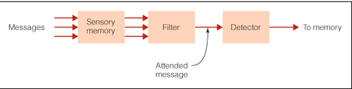

# Broadbent's filter model of attention
This is the earliest [[Information-processing approach]] .
---
## References
[[Goldstein, Cognitive Psychology]] (p. 89).
> This is where Broadbent entered the scene and proposed, based on the results of experiments studying selective attention, his filter model of attention, which we introduced in Chapter 1( Figure 1.10) (Broadbent, 1958). 

## Backlinks
* [[Attenuation model of attention]]
	* ## Because the cocktail party effect can't be explained by the [[Broadbent's filter model of attention]], this model introduces an attenuator.
* [[The evolution of model to understand attention]]
	* [[Broadbent's filter model of attention]]
* [[Atkison-Shiffrin Memory Model]]
	* 10 years after [[Broadbent's filter model of attention]] was introduced...
* [[Dichotic listening can be explained by different attention models]]
	* [[Broadbent's filter model of attention]] or [[Information-processing approach]]
* [[Which cognitive model should be used?]]
	* Given that [[The purpose of a model is to simplify]], some models seems to be simpler to understand than other. The introduction of [[Attenuation model of attention]] for example feels very complex, but this doesn't necessarily mean that [[Broadbent's filter model of attention]] is wrong.

<!-- #evergreen -->

<!-- {BearID:2B0ACC2D-0F73-41F3-8AA9-7D347B60802E-81026-00000C170ED95995} -->
