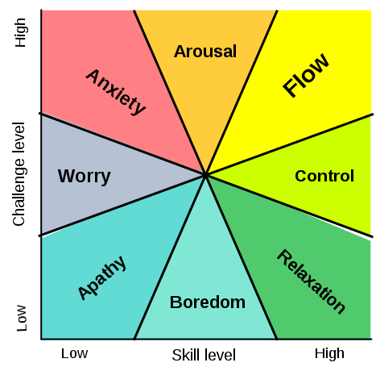

# Flow model

---
## References
[File:Challenge vs skill.svg - Wikipedia](https://en.wikipedia.org/wiki/File:Challenge_vs_skill.svg)

## Backlinks
* [[Boring routine can be converted to enjoyment]]
	* As much as we want to be happy all the time, we can’t escape from the fact that there are chores, boring routines in our day to day life. Many people  hate washing the dishes. Do the dishes have to be boring though? Boredom, according to [[Flow model]], happens when the activity you are doing requires low skill and has low challenge. You could theoretically increase the challenge and skill of dishwashing. For example, I have been trying to find the most optimal way of washing the dishes, should I brush them in batch? How best can I stack them up to dry?

<!-- #evergreen #flow -->

<!-- {BearID:43B7A807-BC67-4B28-A5C6-711B8748032A-805-00003B5B00BCF9DB} -->
