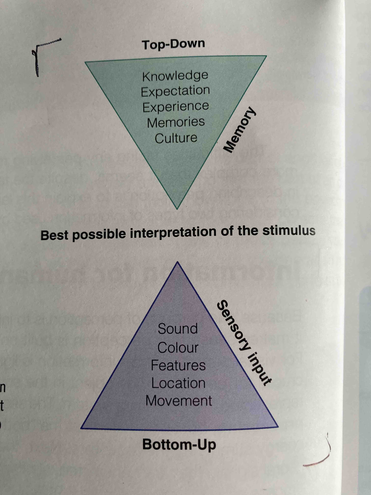

# Perception combines bottom-up and top-down processing
[[Perception]] starts from the senses (bottom-up), but the final result of what we perceive combines what we receive from our senses and our memory, such as knowledge and experiences (top-down).

- - -
## References
[[Goldstein, Cognitive Psychology]]  (p.57).
> The sequence of events from eye to brain is called bottom-up processing, because it starts at the "bottom" or beginning of the system. [...] Perception also involves factors such as a person's knowledge of the environment, the expectations people bring to the perceptual situation, and their attention to specific stimuli.

[[Goldstein, Cognitive Psychology]] (p. 58).
> Figure 3.10 Perception is always a combination of both top-down and bottom-up processing. Bottom-up refers to what comes from the environment and top-down refers to what the individual brings.

## Backlinks
* [[Multiple approaches to perception]]
	* All of these approaches have a common thread: Our top-down past experiences determines our perception ([[Perception combines bottom-up and top-down processing]]).
* [[Perception of pain can be affected by expectation]]
	* It's easy to think that pain is all bottom-up processing ([[Perception combines bottom-up and top-down processing]]), but there are evidence that the perception of pain can be altered by what we expect and what we pay attention to.
* [[Listening to foreign language requires top-down processing]]
	* [[Perception combines bottom-up and top-down processing]]. It is easy to understand that that things we perceive are coming from our senses, but harder to understand what top-down processing means without an example.

<!-- #evergreen -->

<!-- {BearID:5F637834-72E3-4E45-AB3D-5E893B8F4A2B-5941-00000744DC6CD43E} -->
