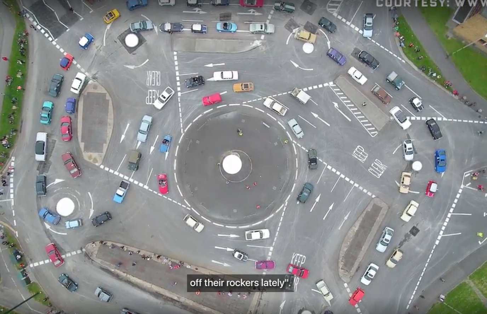

# Traffic control as an example of constraints
There are many [[Types of constraints]]. One good example that has been presented in the [[Cynefin Basecamp Nov 2023]] is traffic control systems.

The Swindon Magic Roundabout (image from [The Brilliant Sorcery of England's 7-Circle Magic Roundabout](https://www.wired.com/2016/08/brilliant-sorcery-englands-7-circle-magic-roundabout/)):

From Unsplash: [Photo by Sabrina Sölch on Unsplash](https://unsplash.com/photos/grayscale-photo-of-man-riding-city-bike-passing-by-pedestrian-lane-kBfcAZ8mzZs)

There are types of constraints:
- Governing/enabling
  - White circle on the roundabout
  - Rule of the road, speed limit signs
- Internal/external
  - Internal: Knowledge of drivers following the rules
  - External: Lane markings
- Connecting/containing
  - Containing: The lanes contains the road users
  - Connecting: Traffic light
- Permeable/Flexible/Rigid
  - The roundabout is more flexible than a traffic light. If a traffic light is still on at night despite traffic, it becomes ineffective. Roundabout on the other hand let the user decide on itself.
- Dark constraint
  - Morale: A person is still using the cycling lane despite no vehicles being around.

<!-- #evergreen -->

<!-- {BearID:69CC55FC-447F-4D31-8116-9DF960C239A3} -->
