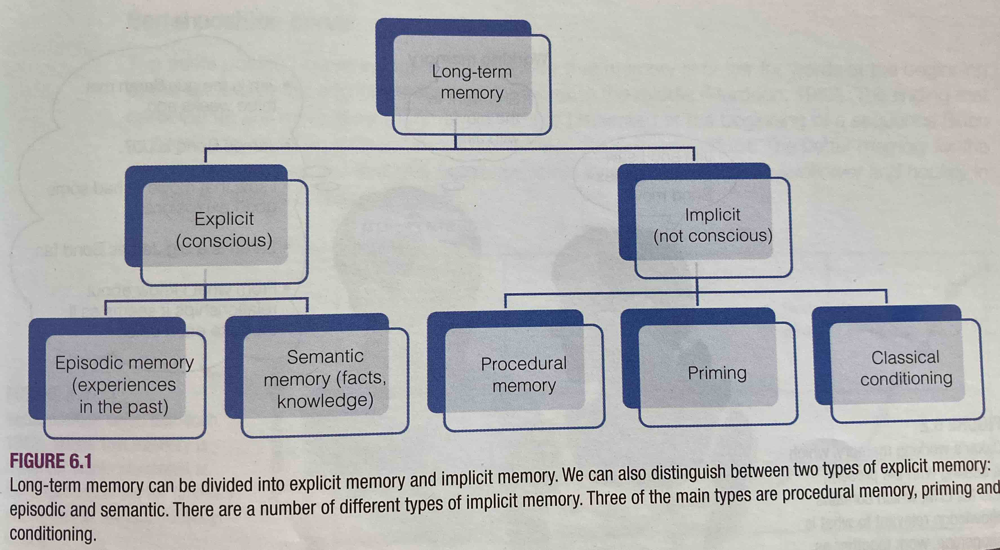

# Types of Long-term Memory
The types of [[Long-term memory]]:
- [[Explicit memory]]
  - [[Episodic memory]]
  - [[Semantic memory might be the context-less version of episodic memory]]
- Implicit memory
  - Priming
  - Classical conditioning
  - Procedural memory

---
## References
[[Goldstein, Cognitive Psychology]] (p. 165).
## Backlinks
* [[Episodic memory]]
	* One of the [[Types of Long-term Memory]] that involves mental time travel.
* [[Explicit memory]]
	* One of [[Types of Long-term Memory]] that you have to explicitly, consciously recall.

<!-- #evergreen -->

<!-- {BearID:88FA89F1-CEF9-403F-BB9D-447A49739152} -->
