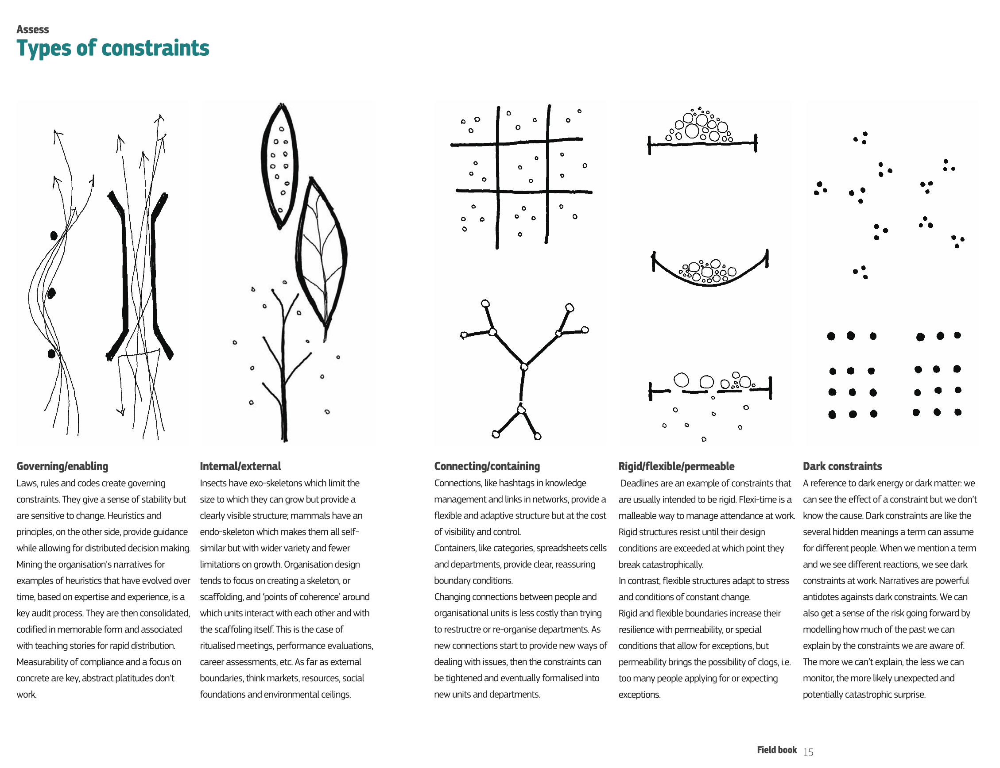

# Types of constraints
One of the best way to understand the types of [[Constraint]] is to elaborate them by examples, these are my examples of physical and mental/knowledge. The official definition is best defined in the references.

- Governing/enabling
  Why is this considered a single type? I think the answer lies in the idea of applying rules to change movement and direction (look at the picture in the reference).

  - In a product team
    - Governing: an architectural principle or strategy is a governing constraint. We can say "Prefer throwing a domain specific errors than generic errors". This will let engineers choose domain specific errors first, but it doesn't necessarily mean generic errors are not allowed.
    - Enabling: Simple rules like "If a tool is below £50, just pay for it". Behaviour: It enables the team to make decisions faster.
  - In a playground
    - Governing: Age restriction.
    - Enabling: Having variety of equipment (slides, swings, etc), it suggests children can play with them but not how they must be used (shaping their behaviour).

- Internal/external
  - In a product team, individual's belief is an internal constraint. The notion of the team itself is an external constraint, providing a boundary to who and how frequent you should talk to.
  - In a playground, an internal constraint could be the layout of the playground itself and what you can play be placed. An external constraint is the boundary of where the playground ends, so children know where they should (not) play.

- Connecting/containing
  - In a product team, a chat software as a connecting constraint, it shapes the team's behaviour. An architectural principle like "Leverage AWS services first", could be seen as something containing.
  - In a playground, a sandbox as a containing constraint. It contains where the sands should stay. I've seen a playground with a high rope connecting from one section to another, a connecting constraint.

- Rigid/flexible/permeable
  - In a product team, rules such as:
    - Rigid: "We must work in the office every day"
    - Flexible: "We must work in the office unless you're sick"
    - Permeable: "We must work in the office at least 2 days a week"
  - In a playground:
    - Rigid: "Strictly no dogs".
    - Flexible: "No aggressive dogs" - how do you define aggressiveness? It's flexible.
    - Permeable: "No dogs - unless no one else is inside"

- Dark constraints
  - In a product team, the presence of someone, may affect the team's behaviour. Once I turned up as a coach in a team, they said, "Now that Wisen is here, let's write tests" (See: [[Observer effect may impact a complex system]])
  - In a playground:
    - You'll notice that most grownups won't be playing. There's a hidden notion that they're not going to, or allowed to play.
    - The idea to "queue up" is never written anywhere, but grownups will put that constraints.

---
## References
[[Snowden, Managing Complexity (and Chaos) in Times of Crisis]]
> 

[Constraints | Cynefin Wiki](https://cynefin.io/wiki/Constraints)
> There are many ways to categorize and describe constraints...

[[Cynefin Basecamp Nov 2023]]
> Steve Jobs is a dark constraint

[[Cynefin Basecamp Nov 2023]]
> Constraint examples:  
> 
> ● Individual: attitudes, beliefs, values, habits, routine, personal traits (risk aversion), roles, (clashing) identities, ideas
> ● Group: norms, culture, traditions, (unexpressed) expectations, hierarchy
> ● Context: resources (money, time, people), circumstances, laws
> ● Physical: landscape, climate, laws of nature

## Backlinks
* [[Are there relationship in between constraint types and Cynefin domains?]]
	* There are conflicting information around how the idea of [[Types of constraints]] and [[Cynefin domains]] are related to each other.
* [[Traffic control as an example of constraints]]
	* There are many [[Types of constraints]]. One good example that has been presented in the [[Cynefin Basecamp Nov 2023]] is traffic control systems.

<!-- #evergreen -->

<!-- {BearID:5C3C5D21-870A-4A64-A227-A6FD18B1A213} -->
